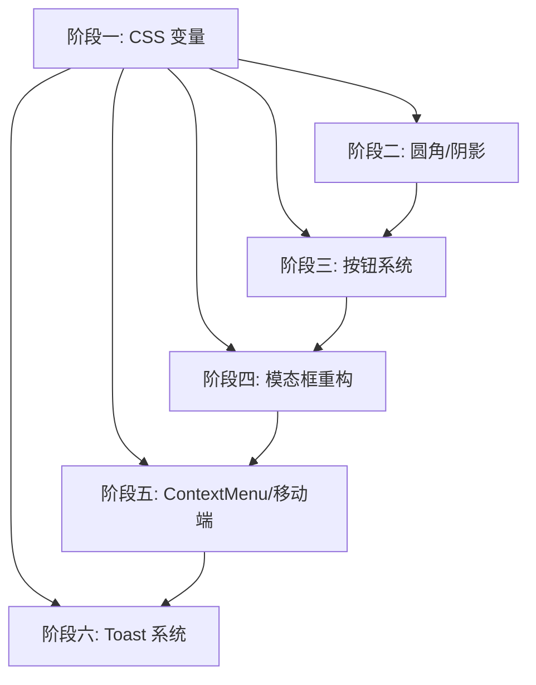

# Flore RSS 阅读器 — 设计一致性优化方案

> 基于 `design-analysis-report.md` 生成 | 实施路线图与任务分解

---

## 一、概述

### 1.1 优化目标

消除前端组件间的设计不一致，建立统一的设计系统落地，提升视觉一致性和用户体验。

### 1.2 总体策略

- **不引入新框架**，在现有 Tailwind CSS 3 + CSS 变量体系内完成
- **优先修复 CSS 变量基础设施**，再统一组件引用
- **分阶段实施**，每阶段独立可交付，不阻塞其他开发工作
- **行为不变**，不改变现有交互逻辑，仅改动视觉样式和代码组织

---

## 二、实施路线图

### 阶段一：CSS 变量基础设施修复（预计 1-2 天）

| 序号 | 任务 | 说明 | 涉及文件 |
|------|------|------|---------|
| 1.1 | 新增缺失 CSS 变量 | `--overlay`, `--overlay-mobile`, `--focus-ring`, `--sidebar-bg`, `--primary-active`, `--selection-bg`, `--duration-*` | `apps/web/src/index.css` |
| 1.2 | 暗色模式补充 | 深色主题下 `--overlay` 和 `--overlay-mobile` 的独立值 | `apps/web/src/index.css` |
| 1.3 | 修复 `accentColor` 主题冲突 | `applyAccentColor()` 区分浅色/深色模式，深色模式下自动调亮 | `apps/web/src/index.css` + 相关调用处 |
| 1.4 | 优化暗色模式对比度 | 调整 `--bg-canvas`, `--bg-surface`, `--bg-elevated`, `--text-muted`, `--border-subtle` 值 | `apps/web/src/index.css` |

**交付标准**：CSS 变量定义完整，暗色模式对比度通过 WCAG AA 标准（文本对比度 >= 4.5:1）。

---

### 阶段二：统一圆角 & 阴影系统（预计 1 天）

| 序号 | 任务 | 说明 | 涉及文件 |
|------|------|------|---------|
| 2.1 | 建立圆角映射规范 | 按钮/输入框 -> `--radius-sm`(4px), 卡片/面板 -> `--radius-md`(6px), 模态框/弹窗 -> `--radius-lg`(8px) | 规范文档 |
| 2.2 | 替换组件中的 hard-coded 圆角 | 将 `rounded-sm`/`rounded-md`/`rounded-lg` 替换为对应的 CSS 变量或统一映射 | `ModalLayout.tsx`, `SettingsModal.tsx`, `SearchBox.tsx`, `AddSourceModal.tsx`, `RenameModal.tsx`, `App.tsx`, `EmptyState.tsx`, `ContextMenu.tsx`, `TitleBar.tsx` |
| 2.3 | 替换阴影变量 | 将 `shadow-md`/`shadow-lg` 替换为 `var(--shadow-md)`/`var(--shadow-lg)` | `ContextMenu.tsx`, `SettingsModal.tsx`, `ModalLayout.tsx` |

**交付标准**：所有 UI 组件不再使用直接 hard-coded 圆角/阴影类，统一通过 CSS 变量或 Tailwind 映射引用。

---

### 阶段三：按钮系统标准化（预计 1-2 天）

| 序号 | 任务 | 说明 | 涉及文件 |
|------|------|------|---------|
| 3.1 | 创建标准化 `Button` 组件 | 支持 `variant: primary | secondary | ghost | icon`、`size: sm | md` | 新建 `apps/web/src/components/Button.tsx` |
| 3.2 | 按钮类型映射表 | Primary: 32px, 6px, semibold 13px; Secondary: 32px, 6px, medium 13px; Ghost: 32px, 6px; Icon: 28-32px, 6px | 组件内部 |
| 3.3 | 逐步替换现有按钮 | 先替换 `ModalLayout` 和 `SettingsModal`，再替换弹窗中的确认/取消按钮 | 各弹窗组件 |

**交付标准**：`Button` 组件通过 `cn()` 工具函数拼接 className，支持 hover/active/focus/disabled 状态，所有弹窗按钮统一使用该组件。

---

### 阶段四：模态框系统重构（预计 1-2 天）

| 序号 | 任务 | 说明 | 涉及文件 |
|------|------|------|---------|
| 4.1 | 统一遮罩层 | 所有模态框和侧边栏遮罩使用 `var(--overlay)` + `backdrop-blur-sm` | `ModalLayout.tsx`, `SettingsModal.tsx`, `App.tsx` |
| 4.2 | 提取通用 ModalShell | 将 `ModalLayout.tsx` 的遮罩、焦点陷阱、Escape 关闭、动画抽象为可复用 Shell | `ModalLayout.tsx` |
| 4.3 | 统一弹窗宽度/高度规范 | 定义标准弹窗尺寸：小(400px)、中(480px, default)、大(640px)、全(920px) | `ModalLayout.tsx` |

**交付标准**：`SettingsModal` 使用 `ModalLayout` 作为基础，消除重复的遮罩/关闭/动画代码。

---

### 阶段五：修复 ContextMenu & 移动端样式（预计 0.5 天）

| 序号 | 任务 | 说明 | 涉及文件 |
|------|------|------|---------|
| 5.1 | ContextMenu 改用 `cn()` | 替换字符串拼接 className | `ContextMenu.tsx` |
| 5.2 | ContextMenu 添加过渡动画 | 添加 `transition` + `duration-150` | `ContextMenu.tsx` |
| 5.3 | Danger 项 hover 态 | 添加 `hover:bg-danger/10` 或类似视觉反馈 | `ContextMenu.tsx` |
| 5.4 | 移动端遮罩改用 CSS 变量 | 替换固定颜色 `rgba(26,26,26,0.45)` 为 `var(--overlay-mobile)` | `App.tsx` |
| 5.5 | 移动端过渡时间 | 将 `duration-250` 替换为 `duration-200` 或 `var(--duration-normal)` | `App.tsx` |

---

### 阶段六：实现 Toast 系统（预计 0.5 天）

| 序号 | 任务 | 说明 | 涉及文件 |
|------|------|------|---------|
| 6.1 | 创建 `ToastContainer.tsx` | 基于 `toast.ts` store 的订阅渲染组件 | 新建 `apps/web/src/components/ToastContainer.tsx` |
| 6.2 | 在 `App.tsx` 中挂载 | 在根组件中渲染 `ToastContainer` | `App.tsx` |
| 6.3 | 动画与定位 | 固定在右下角，支持入场/出场动画，自动消失 | `ToastContainer.tsx` |

---

## 三、任务优先级与依赖关系

- **阶段一** 是所有后续阶段的前置依赖
- **阶段二 → 三** 有弱依赖（圆角统一后按钮更易标准化）
- **阶段三 → 四** 有依赖（模态框使用标准化按钮）
- **阶段五、六** 可并行实施，但需阶段一完成

---

## 四、代码改动清单

### 4.1 新增文件

| 文件 | 阶段 | 说明 |
|------|------|------|
| `apps/web/src/components/Button.tsx` | 三 | 标准化 Button 组件 |
| `apps/web/src/components/ToastContainer.tsx` | 六 | Toast 渲染组件 |

### 4.2 修改文件

| 文件 | 阶段 | 改动内容 |
|------|------|---------|
| `apps/web/src/index.css` | 一、二 | 新增/修改 CSS 变量，调整暗色模式值 |
| `apps/web/src/App.tsx` | 一、五、六 | 移动端遮罩变量化，挂载 ToastContainer |
| `apps/web/src/components/ModalLayout.tsx` | 二、三、四 | 圆角/阴影变量化，按钮替换，提取 Shell |
| `apps/web/src/components/SettingsModal.tsx` | 二、三、四 | 圆角/阴影变量化，按钮替换，复用 ModalShell |
| `apps/web/src/components/ContextMenu.tsx` | 二、五 | 圆角变量化，cn() 替换，动画 |
| `apps/web/src/components/SearchBox.tsx` | 二 | 圆角变量化 |
| `apps/web/src/components/AddSourceModal.tsx` | 二、三 | 圆角变量化，按钮替换 |
| `apps/web/src/components/EditSourceModal.tsx` | 三 | 按钮替换 |
| `apps/web/src/components/RenameModal.tsx` | 二、三 | 圆角变量化，按钮替换 |
| `apps/web/src/components/EmptyState.tsx` | 二 | 圆角变量化 |
| `apps/web/src/components/TitleBar.tsx` | 二 | 圆角变量化 |
| `apps/web/src/components/IconButton.tsx` | 三 | 映射到 Button 组件 |

---

## 五、验证标准

### 5.1 每个阶段完成后验证

1. **视觉回归检查**：对比改动前后的页面截图，确认无意外的样式变化
2. **控制台检查**：无 CSS 变量未定义警告，无 Tailwind 类名拼写错误
3. **交互检查**：hover/active/focus 状态正常，动画流畅

### 5.2 全局验证

1. **浅色/深色模式切换**：所有组件在两种模式下视觉正常
2. **自定义强调色**：设置自定义颜色后，浅色/深色模式均正确显示适配色
3. **响应式**：移动端侧边栏遮罩/动画正常
4. **键盘可访问性**：焦点指示器可见，Tab 顺序正确

---

## 六、风险与注意事项

| 风险 | 影响 | 缓解措施 |
|------|------|---------|
| CSS 变量替换后 Tailwind 类名冲突 | 部分样式失效 | 替换后逐组件视觉检查 |
| `accentColor` 修复可能影响现有用户已设颜色 | 用户自定义颜色显示异常 | 在 `applyAccentColor()` 中添加兼容逻辑 |
| 暗色模式对比度调整后现有用户感受差异 | 部分用户可能不适应 | 保持新旧值的过渡，避免剧烈变化 |
| 按钮组件替换可能导致少量交互差异 | 按钮点击区域/状态变化 | 保持原有 `onClick` 和 `disabled` 行为不变 |

---

## 七、总结

| 阶段 | 内容 | 预计工时 | 优先级 |
|------|------|---------|--------|
| 一 | CSS 变量修复 + 暗色对比度优化 | 1-2 天 | P0 |
| 二 | 圆角/阴影系统统一 | 1 天 | P1 |
| 三 | 按钮系统标准化 | 1-2 天 | P1 |
| 四 | 模态框重构 | 1-2 天 | P1 |
| 五 | ContextMenu + 移动端修复 | 0.5 天 | P2 |
| 六 | Toast 系统实现 | 0.5 天 | P2 |

**总计预计工时**：5-8 天（可并行实施部分阶段以缩短工期）